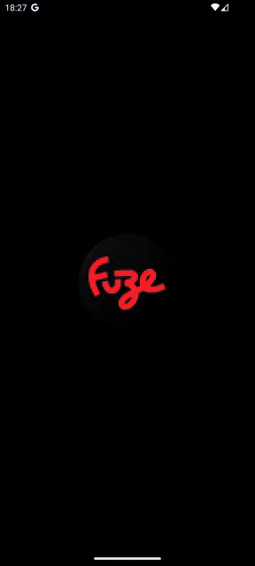

# CSTV



**CSTV** is a native Android application that allows users to explore live and upcoming **CS:GO** matches. It provides a clean, modern interface built entirely with **Jetpack Compose**.

---

## ✨ Features

- View **currently running** and **upcoming CS:GO matches**
- Explore team details and players
- Pull-to-refresh support
- Infinite scroll: load more matches as the user scrolls the list down
- Responsive layout: The app automatically adapts to screen orientation, providing an optimized experience in both portrait and landscape modes.
- Multi-language support: Supports both Portuguese and English based on device language settings

---

## 🧱 Architecture

This project follows **Clean Architecture**, **SOLID principles**, and the **MVVM pattern** to ensure testability, maintainability, and separation of concerns.

## 🛠️ Tech Stack

| Layer          | Library/Tool            |
|----------------|-------------------------|
| UI             | Jetpack Compose         |
| Image Loading  | Coil                    |
| DI             | Dagger Hilt             |
| Networking     | Retrofit + OkHttp       |
| Async/Threading| Kotlin Coroutines       |
| Architecture   | MVVM + Clean Architecture |
| Testing        | JUnit4 + MockK          |


## 🚀 Getting Started

To run this project:

1. Clone the repository:
   ```bash
   git clone https://github.com/LuanApps/cstv.git
   ```
2. Get your API Access Token from pandascore: https://app.pandascore.co/dashboard/main
3. Set your API Access Token in your **local.properties**:
    ```gradle
    API_TOKEN=[YOUR_API_ACCESS_TOKEN_HERE]
    ```